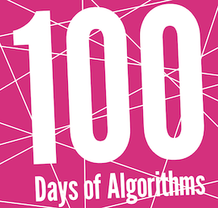

  

## Getting Started

Each algorithm has been saved in their own file, which are present in several different programming languages. Each file has been written so that __zero__ changes are requires to the file, to showcase its mechanism, save for those files that require external input, such as image. The intructions to run each file type follow:

### MacOS

Python and Node should both be preinstalled on your computer. For Julia, you'll hav eto install it manually via `brew install julia`. For Java, I'd recommend a an IDE like [IntelliJ](https://www.jetbrains.com/idea/download/?fromIDE=#section=mac) (or [Eclipse](https://www.eclipse.org/downloads/)) and installing [OpenJDK](https://jdk.java.net/18/). Otherwise, you might find that compiling Java classes comes with a load of pain and frustration. Actually, doing anything in Java is a pain, hence why I used it only sparingly. 

| Language   | First Command          | Second Command |
|------------|------------------------|----------------|
| Python     | `python [filename].py` |                |
| JavaScript | `node [filename].js`   |                |
| Julia      | `julia [filename].js`  |                |
| C          | `gcc [filename].c`     | `./a.out`      |
| C++        | `g++ [filename].cpp`   | `./a.out`      |
| Java       |                        |                |

### Windows

TODO

#### Linux

MacOS and Linux both use the Linux kernel, hence why the commands should be more or less the same. 
